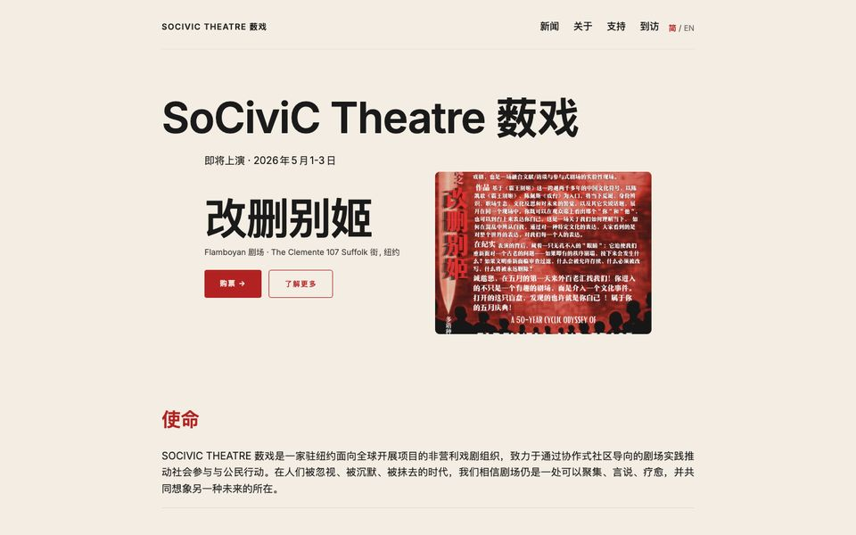

Symbiosis Lab builds collection, archive and exhibition sites with [moss](https://github.com/Symbiosis-Lab/moss), its open-source tool. A site is a folder of files you own: pages in markdown, images beside them, a spreadsheet of metadata if you keep one. There is no server and no database, and the finished site can be published anywhere.

## What moss does for collections today

:::grid 2

**One page per object.** The image first, then the catalogue record: artist, date, credit, licence and source.
+++

**Ordered sequences.** Previous and next follow the order of the series, with the place in it: 37 of 55.
+++

**Places and maps.** Each object sits where it was made or depicted, with a map of the whole collection.
+++

**Bilingual sites.** One site, two or more language editions, each with its own address.
:::

- **Image variants, made automatically.** Every picture is resized and converted when the site is built, so you keep one original.
- **Search** across the whole site, with nothing to host.
- **Chinese typesetting.** Chinese and English editions of one site, set with their own type.
- **Publish to GitHub Pages or any host** that serves files.
- **Static files that keep working.** A built site is plain HTML, CSS and images, and it does not depend on moss, or on us, to stay up.

## Collections we built

:::grid 2

**[Fifty-three Stations of the Tōkaidō](https://tokaido.mosspub.com/).** Hiroshige's fifty-five prints of the road from Edo to Kyoto, in order, each with its catalogue record and a place on the map.
+++

**[William Blake](https://www.blakesnotebook.com/).** A reading room for the illuminated books, the paintings and prints, and the writings.
+++

**[Virginia Woolf](https://virginia-woolf.mosspub.com/).** Her essays, fiction and talks, gathered as a reading collection.
+++

**[Chautauqua Literary and Scientific Circle](https://chautauqua-circle.mosspub.com/).** A nineteenth-century reading circle: its course of reading, local circles and notices.
:::

## Client work

:::grid 2

**[SoCiviC Theatre](https://www.socivic.org/).** A theatre company's news, past productions and visitor information, in English and Simplified Chinese.
+++

**[Center for Habitable Planetary Systems](https://www.um-chps.org/).** A University of Michigan research centre: its mission, faculty, projects and publications.
+++

**[Yin Lab](https://www.yinlab.io/).** An NYU research lab: its research themes, publications, team and resources.
+++

**[在場·獎學金](https://frontline.mosspub.com/).** A Chinese-language scholarship programme: its writing and comics awards, past seasons, a map of places and an English section.
:::

## Proposed: CollectionBuilder in moss

This is proposed work. We have not shipped it.

[CollectionBuilder](https://collectionbuilder.github.io/) is the Jekyll toolkit that many libraries and archives use to publish a spreadsheet of objects as a website. We propose two ways to bring it together with moss, and either one starts from the same spreadsheet and folder.

- **Route 1, build with moss.** A CollectionBuilder project runs unchanged in moss, with no Ruby. It keeps CollectionBuilder's own templates and look, shows a live preview that flags metadata problems where they occur, and publishes anywhere.
- **Route 2, check on Jekyll.** The same checks, and image and PDF thumbnails, as a GitHub Action for projects that are staying on Jekyll.

One measured fact: a no-Ruby prototype reproduced 93–99% of Jekyll's rendered files byte for byte on CollectionBuilder's demo and three community sites, and 98–100% when whitespace is ignored. It is a prototype.

:::grid 2 {.figures}

+++

:::

Figures drawn with Hairline by Lucas Marques (MIT).

## Contact

::: {.work-cta}
[Write to hi@symbiosis-lab.org →](mailto:hi@symbiosis-lab.org)
:::
