Symbiosis Lab builds collection, archive and exhibition sites with [moss](https://github.com/Symbiosis-Lab/moss), its open-source tool. A site is a folder of files you own: pages in markdown, images beside them, a spreadsheet of metadata if you keep one. There is no server and no database, and the finished site can be published anywhere.

## What moss does for collections today

A moss site is plain static files: no server, no database and nothing loaded from a third party, so it costs little or nothing to host on GitHub Pages or any web host, and it keeps working after the grant ends and the people who built it move on. Every object gets its own page: images sized for every screen, a series in order with "37 of 55", places on a map, and search that runs in the visitor's browser.

:::grid 2

+++
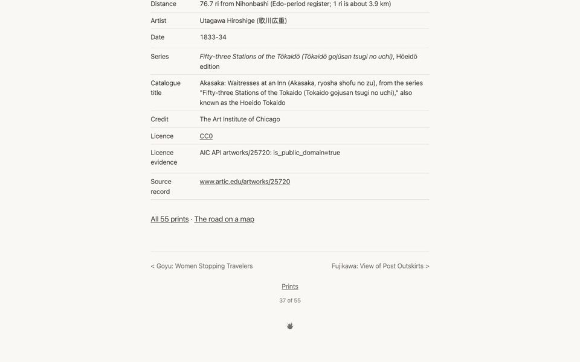
+++
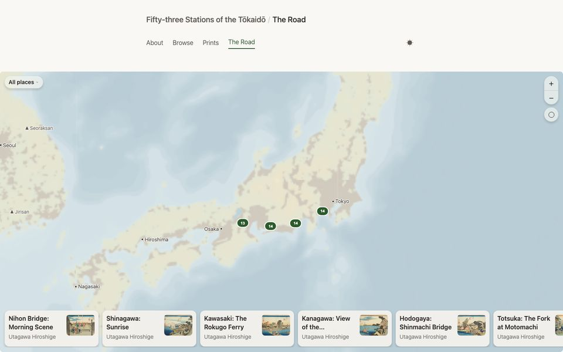
+++
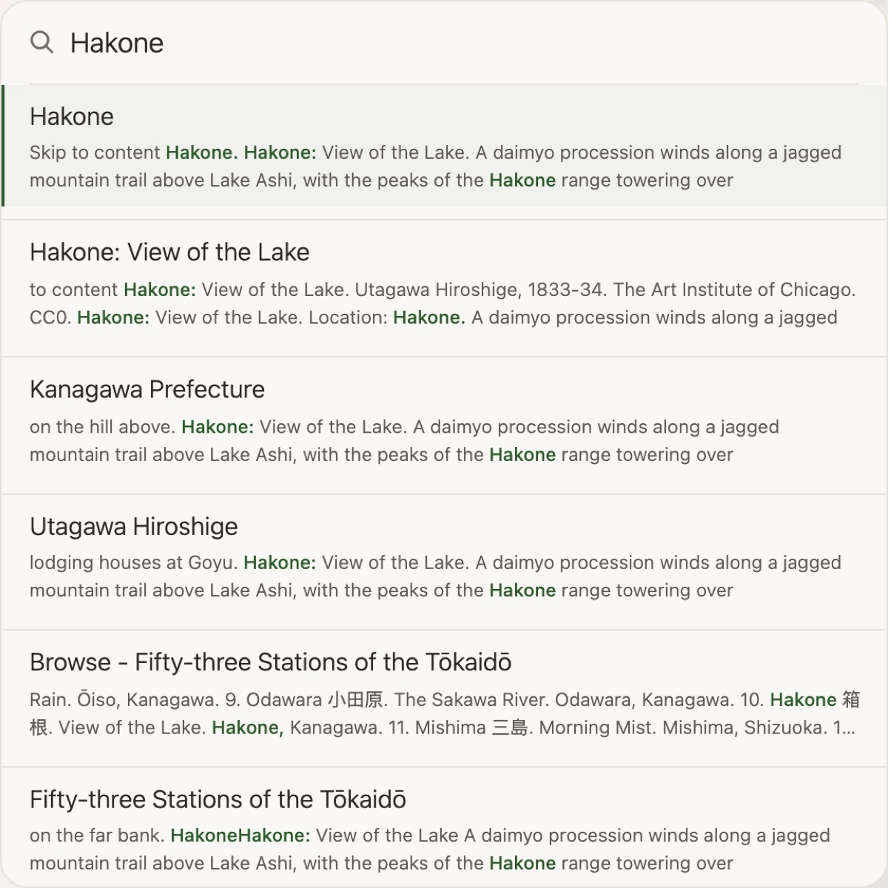
:::

### Beyond a typical static site generator

- **Nothing to install but the app.** Open the folder in the moss app; there is no programming language, package manager or image toolkit to set up first. (The app runs on macOS today; Windows is in progress.)
- **A live preview that points at problems.** The site updates as you edit, and problems are reported while you work, not after you publish.
- **Images and media, handled.** Sizes and formats are made for you; video, audio, PDF and 3D files embed the same way as images.
- **Maps that ship with the site.** A page for every place and routes along a journey, with the map data included rather than loaded from an online service.
- **Several languages per site.**
- **Essays beside the catalogue.** Essays, series and object pages live in one folder and link to each other.
- **Publishing that protects your links.** Publish from the app to GitHub Pages or any host; moss refuses to publish a change that would break an address people already link to.

### Not yet

Metadata from a spreadsheet, faceted browse, data downloads, IIIF deep zoom and rights fields. That is where moss is going next.

## Collections we built

:::grid 1

**[Fifty-three Stations of the Tōkaidō](https://tokaido.mosspub.com/).** Hiroshige's fifty-five prints of the road from Edo to Kyoto, in order, each with its catalogue record and a place on the map.
:::

:::grid 2
[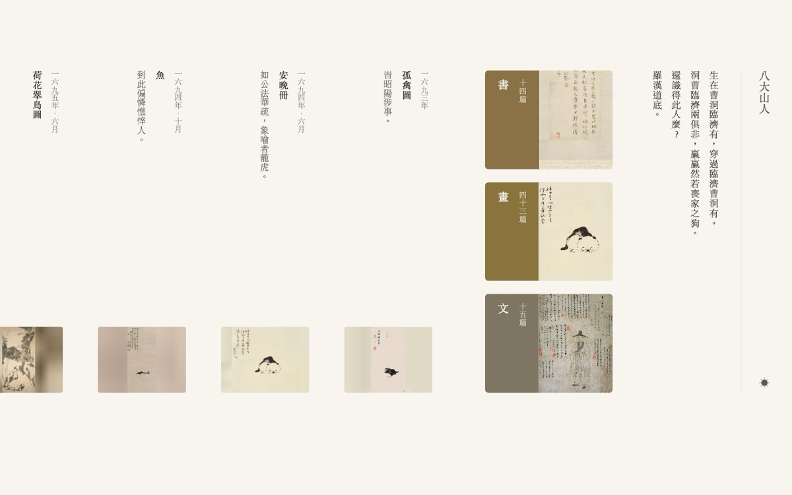](https://www.zhudasnotebook.com/)

**[Zhu Da (八大山人)](https://www.zhudasnotebook.com/).** The painter's paintings, calligraphy and letters, 1626–1705, set in vertical Chinese.
+++
[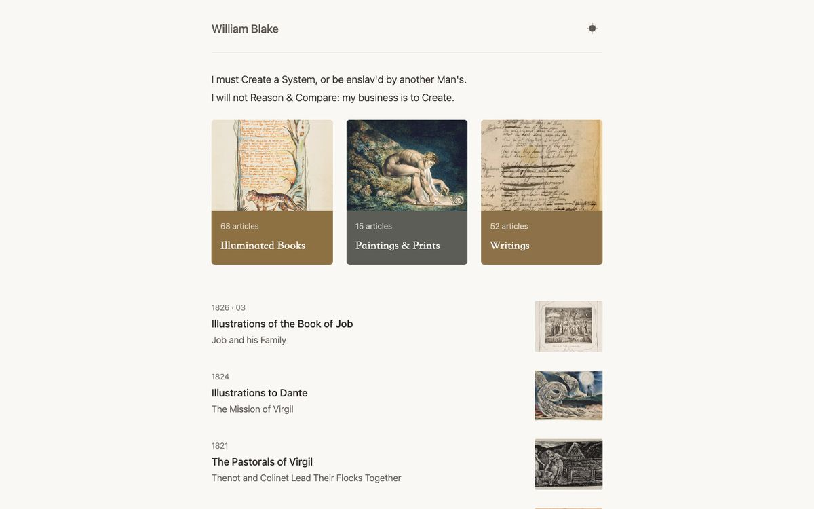](https://www.blakesnotebook.com/)

**[William Blake](https://www.blakesnotebook.com/).** A reading room for the illuminated books, the paintings and prints, and the writings.
+++
[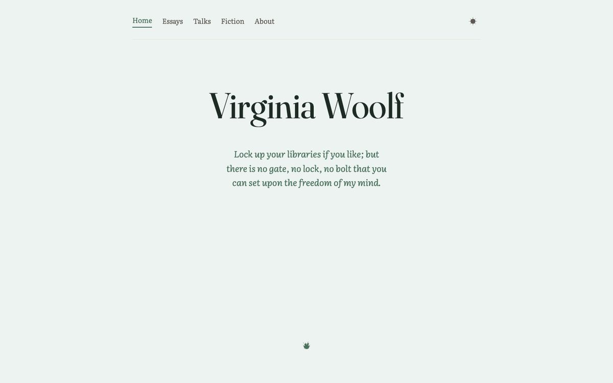](https://virginia-woolf.mosspub.com/)

**[Virginia Woolf](https://virginia-woolf.mosspub.com/).** Her essays, fiction and talks, gathered as a reading collection.
+++
[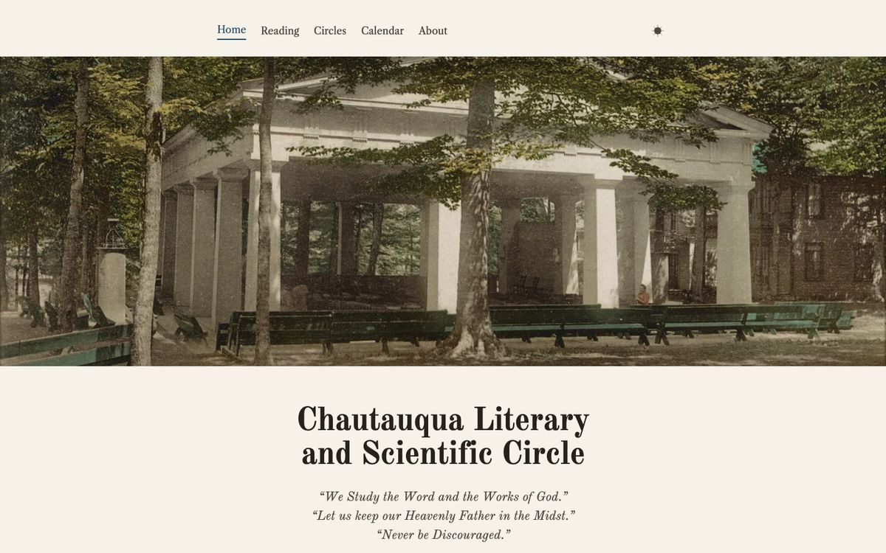](https://chautauqua-circle.mosspub.com/)

**[Chautauqua Literary and Scientific Circle](https://chautauqua-circle.mosspub.com/).** A nineteenth-century reading circle: its course of reading, local circles and notices.
:::

## Selected client work

:::grid 2
[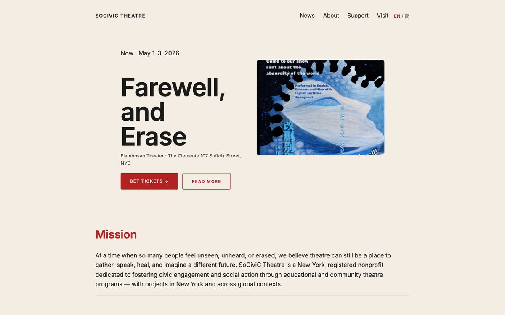](https://www.socivic.org/)

**[SoCiviC Theatre](https://www.socivic.org/).** A theatre company's news, past productions and visitor information, in English and Simplified Chinese.
+++
[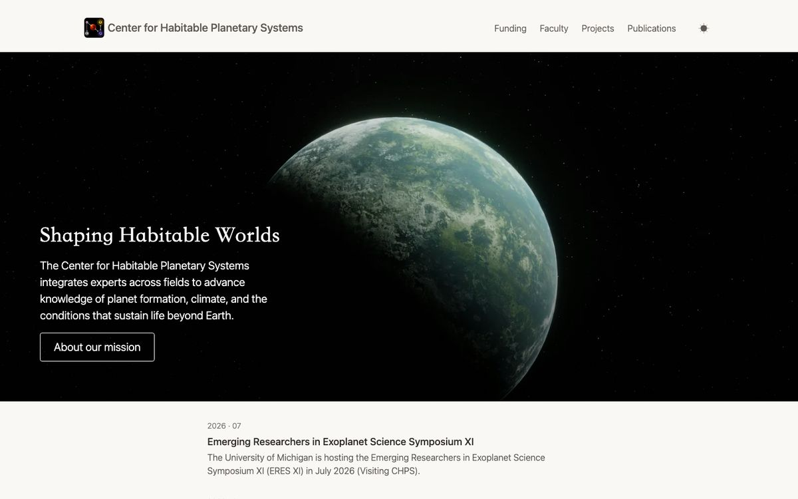](https://www.um-chps.org/)

**[Center for Habitable Planetary Systems](https://www.um-chps.org/).** A University of Michigan research centre: its mission, faculty, projects and publications.
+++
[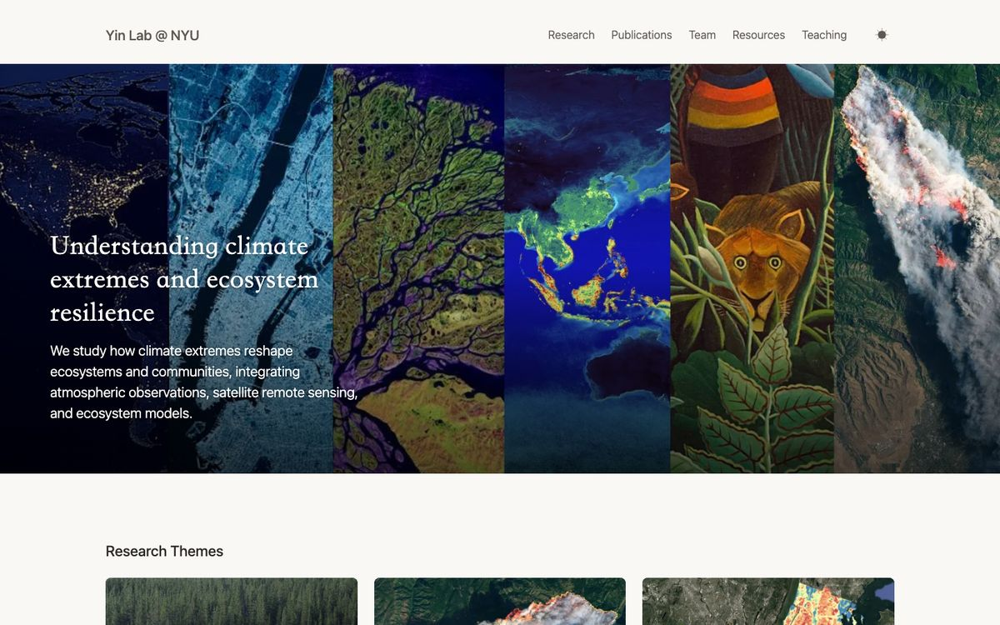](https://www.yinlab.io/)

**[Yin Lab](https://www.yinlab.io/).** An NYU research lab: its research themes, publications, team and resources.
+++

**[在場·獎學金](https://frontline.mosspub.com/).** A Chinese-language scholarship programme: its writing and comics awards, past seasons, a map of places and an English section.
:::

## Where moss is going: collections from a spreadsheet

[CollectionBuilder](https://collectionbuilder.github.io/) has the right idea: a collection is a spreadsheet and a folder of files, and the website is built from them. That is also where moss is weakest today. So the next stage of moss brings the two together, in steps that each stand on their own:

1. **Checks and thumbnails for every CollectionBuilder project.** A command and a GitHub Action that catch metadata problems before the site builds, and make image and PDF thumbnails without ImageMagick or Ghostscript. Useful whether or not you ever open moss.
2. **CollectionBuilder projects in moss, unchanged.** Open the folder and get a live preview, problems flagged where they occur, and publishing anywhere, with CollectionBuilder's own templates and look and no Ruby. A prototype already reproduces 93–99% of Jekyll's pages byte for byte on CollectionBuilder's demo and three community sites.
3. **Spreadsheet collections in moss.** A spreadsheet in a folder becomes one page per row, using CollectionBuilder's column names. When we built Hiroshige's Tōkaidō both ways, changing the credit line on every print took one edit in the spreadsheet and fifty-five in separate files.
4. **What collections expect.** Data downloads, a rights field, faceted browse and search by field.

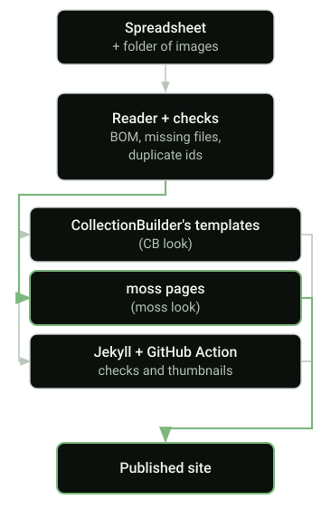

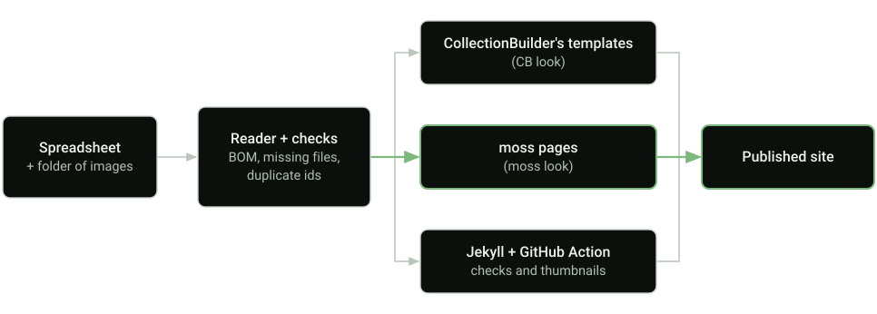

All of it is open source, and the spreadsheet and folder stay yours whichever tool builds them.

## Contact

::: {.work-cta}
[Write to hi@symbiosis-lab.org →](mailto:hi@symbiosis-lab.org)
:::
